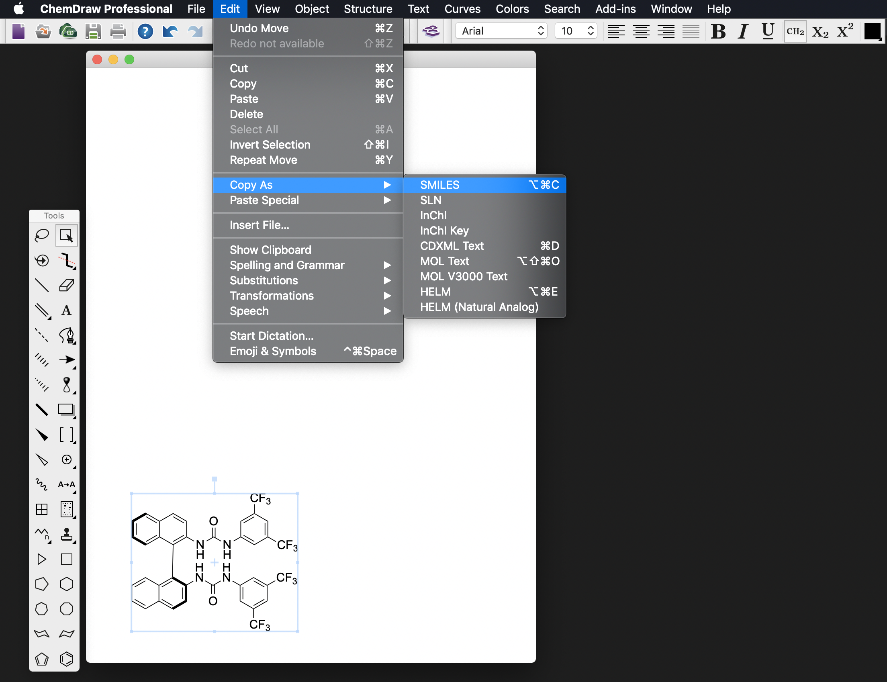

# A computer aided workflow for Catalyst Design 

 

This workflow is designed to computationally calculate properties for hydrogen-bonding catalysts. For each catalyst physical, chemical and structural descriptors are calculated and then given as an input to a machine learning (ML) model. The aim is to use the knowledge gained from previous analysis to predict the reactivity of new catalysts. The code is written in Python 3. MatLab is used for the ML analysis. Data can be provided upon request.

## Requirements:

0. Python v. 3.7
1. rdkit
2. numpy
3. OpenBabel
4. ORCA v. 4.1 
5. XTB v. 6.1
6. MatLab v. R2019a


### Generating SMILES strings
[SMILES](https://en.wikipedia.org/wiki/Simplified_molecular-input_line-entry_system) strings can be generated directly
from ChemDraw. For example:


## The scripts are used as follows:

## For the physical and chemical descriptors

a) The SMILES strings of the catalysts are used as an input for **smileTopdb.py**. The user has to give a .txt file with the SMILES strings of interest and the pdb files will be created.

b)Add the anion manually in the most suitable possition for your system and save the new pdb/xyz file.

c)To generate conformers XTB v. 6.1 is used. The pdb files of the catalyst-anion complex, are converted to xyz files with OpenBabel obabel and given to XTB.

```
obabel filename.pdb -O filename.xyz
```

d) A series of .scoord files will be created. **coord2xyz.py** is used to convert them to xyz files.

e) Some of the conformations will be irrelevant, **accessible_F.py** excludes these conformations. The xyz files are needed as inputs.

f) Some of the remaining conformations will be very similar to each other, **rmsdexclude.py** will exclude conformations that differ for less than 1 Å. The script reads pdb files so OpenBabel is used again. 
```
obabel filename.xyz -O filename.pdb
```

g) Single point energies at the PBE-D3BJ/def2-SVP level of theory are calculated with ORCA. **ORCAmin.py** generates the input files. As an input the xyz files of the conformations of interest are needed.

h) The conformations are weighted according to Boltzmann's distribution. **Boltzmann.py** takes as an input the output files from ORCA and returns as an output a csv file, with the conformations that contribute up to 90%.

i) Optimizations at the same level of theory are performed, for the conformers that contribute up to 90% of the population. **ORCA_input1.py** generates the input files. As an input the xyz files of the conformations of interest are needed.

j) The final single point energies are sorted with **Energy_sort.py** which uses as an input the output files of the ORCA calculations and returns a csv file with the lowest energy conformer.

k) Single point energy corrections at the PBE-D3BJ/def-TZVP level of theory are calculated only for the lowest energy conformations. **ORCA_input2.py** generates the input files. As an input the xyz files of the conformation of interest are needed.

l) From the output files, electronic descriptors are extracted with **descriptors.py**.

## For the structural descriptors

To calculate Steric parameters we slightly altered the Paton and co-workers code [1].

m) To identify the atoms for which we wish to calculate Steric parameters upon, **connectxyz.py**, uses as an input the xyz files of the optimized complexes. The script automatically identifies the carbon and hydrogen atoms that are connected to the nitrogen atoms of the ureas, returning a list of atom ids for each catalyst.

n) L, B1 and B5 values are calculated with **sterimol.py** (it automatically calls **sterimoltools.py** so you need the script in your directory). The script takes as an input the pdb files of the optimized catalysts.

## For the ML model

First you need the training set. 

o) You will need to creat a reaction vector where the descriptors of the substrate, the descriptors of the catalysts, the temperature and the solvent are combined into one vector. Make a list of all the combinations you want (see example List.csv), use **ReactionMatrix.py** to get your finalised data which will be used as input in the ML model.

p) Convert the ee/er of the reactions to DDG and creat a csv where you have the DDG of all the reactions in the same order as in the file Lists.csv you created above. Use **MultiLinearRegression.py** to test your models predicting power.

q) If you want to creat your Test set using new data, repeat step **o** for the new catalysts. If you do not have experimental DDG for these reactions you cannot do step **p** and the model will give you predicted values for these reactions. Use **LR_NewTestSet.py** to print your predicted values.

[1]	A. V. Brethomé, S. P. Fletcher, and R. S. Paton, "Conformational Effects on Physical-Organic Descriptors–the Case of Sterimol Steric Parameters," ACS Catalysis, 2019.


